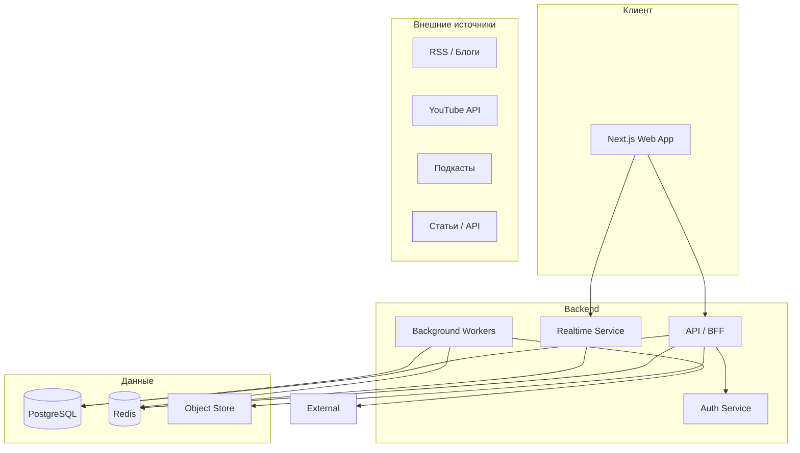

# План проекта Horizon (Ноосфера)

План разработки платформы Horizon: контекстуальные тематические пространства, двухуровневое общение (структурированные обсуждения + синхронные комнаты), интеллектуальный агрегатор контента, совместные ментальные карты, цифровая гигиена и монетизация без рекламы.

**Статус:** Фазы 0–5 (базово) выполнены. Фаза 5: цифровая гигиена — настройки, фокус, таймер, страница дайджеста. Дальше — воркер дайджеста/email. **Монетизация (Фаза 6) отложена.**

---

## Философия и цели

Платформа — инструмент для мышления и осмысленного диалога: тематические «вселенные», структурированные дискуссии, синхронное совместное познание, прозрачная рекомендация контента и фокус на цифровой гигиене. Монетизация через подписку и платные возможности, без рекламы.

---

## Ориентация на дизайн (index.html)

Вся вёрстка и UI должны опираться на макет из **index.html** (лендинг «Ноосфера») в корне проекта. При переносе в Next.js сохранять следующие решения.

**Дизайн-токены (перенести в CSS-переменные / Tailwind theme):**

- **Темы:** светлая и тёмная (по умолчанию — тёмная, класс `dark-theme`).
- **Цвета (тёмная тема):** `--bg-primary: #0f172a`, `--bg-secondary: #1e293b`, `--bg-accent: #334155`; `--text-primary: #f1f5f9`, `--text-secondary: #cbd5e1`, `--text-accent: #60a5fa`; `--border-color: #475569`, `--card-bg: #1e293b`. Акценты: синий `#3b82f6`, фиолетовый `#8b5cf6`, зелёный `#10b981`, оранжевый `#f59e0b`, красный `#ef4444`.
- **Типографика:** шрифт **Inter** (300–700), моно **JetBrains Mono** (400, 500).
- **Радиусы:** 8px, 12px, 16px, 20px (`--radius-sm` … `--radius-xl`).
- **Отступы:** 4, 8, 16, 24, 32, 48px.
- **Анимации:** 0.2s / 0.3s / 0.5s ease; лёгкий pulse для иконки логотипа.

**Ключевые UI-паттерны из макета:**

- **Шапка:** sticky, логотип (иконка мозга + название «Ноосфера»), переключатель темы, CTA «Начать познание».
- **Hero:** заголовок с градиентом (фиолетовый → синий), подзаголовок, кнопка с градиентом и тенью.
- **Карточки концепций:** фон карточки, левая полоска-градиент (5px), иконка, заголовок, описание, теги (pill), блок семантических реакций («Подтверждаю», «Прошу разъяснить», «Важный контраргумент»).
- **Блок вселенных:** табы по вселенным; контент панели — заголовок, статистика (участники, материалы, дискуссии), индикатор режима фокуса (зелёный pill с таймером), текст и список дискуссий.
- **Футер:** логотип, ссылки (О проекте, Принципы, Монетизация, Контакты), копирайт.
- **Реакции:** кнопки с иконкой + текст, фон `--bg-accent`, без «лайков».
- **Режим фокуса:** зелёный pill с иконкой часов и текстом «Режим фокуса активен (таймер: …)».

**Брендинг:** в макете используется название «Ноосфера»; в коде/конфиге можно держать оба варианта (Horizon — репозиторий/продукт, Ноосфера — публичное имя по желанию).

При добавлении новых экранов (вселенные, контент, комнаты, карты, дайджест) использовать эти токены и паттерны, чтобы визуально и по поведению оставаться в едином стиле с index.html.

---

## Рекомендуемый технологический стек

| Слой              | Технологии                                                                 | Обоснование                                                                                    |
| ----------------- | -------------------------------------------------------------------------- | ---------------------------------------------------------------------------------------------- |
| **Frontend**      | Next.js 14+ (App Router), React, TypeScript, Tailwind CSS                  | SSR/SSG, маршрутизация, удобство PWA позже; дизайн-система из index.html (токены, компоненты). |
| **Backend**       | Next.js API Routes + отдельный Node-сервис (или Fastify/NestJS) при росте | Быстрый старт; при необходимости — вынос тяжёлой логики в сервисы.                             |
| **БД**            | PostgreSQL                                                                 | Юзеры, пространства, контент, граф обсуждений, ментальные карты — реляционная модель подходит. |
| **Кэш и очереди** | Redis (сессии, кэш, очереди задач)                                         | Очереди для агрегатора и фоновых дайджестов.                                                   |
| **Real-time**     | WebSockets (Socket.io или uWebSockets) или Ably/Pusher                    | Синхронный просмотр, комнаты, уведомления в реальном времени.                                 |
| **Агрегатор**     | Очереди (BullMQ) + воркеры; опционально Python-микросервис                | Парсинг/нормализация источников; позже — анализ и «противоречия» через отдельный сервис.       |
| **Поиск**         | PostgreSQL FTS или Meilisearch/Typesense                                  | Поиск по контенту и источникам внутри вселенных.                                               |
| **Auth**          | NextAuth.js или Auth.js                                                    | OAuth + email, сессии, защита API.                                                             |
| **Файлы**         | S3-совместимое хранилище (MinIO локально, AWS S3 в проде)                 | Медиа, экспорт карт, вложения.                                                                |

Агрегатор на первом этапе можно реализовать на Node (парсинг RSS, YouTube API, базовые правила). Отдельный Python-микросервис имеет смысл при добавлении ML (связи статей, противоречия, кластеризация).

---

## Архитектура системы (высокоуровнево)



---

## Доменная модель (ядро)

- **User** — профиль, настройки гигиены (таймеры, фокус, дайджест), подписка.
- **Universe** — тематическое пространство: название, описание, правила, типы контента (текст/видео/подкаст/статья), настройки модерации, владелец/модераторы.
- **Content** — элемент контента: источник (внешний URL или загрузка), тип, метаданные, привязка к Universe; может быть результатом агрегации.
- **Discussion** — обсуждение вокруг Content: древовидные/структурированные комментарии с типами (тезис, контраргумент, вопрос).
- **Reaction** — реакции не как «лайк», а семантические: «подтверждаю источником», «прошу разъяснить», «важный контраргумент» и т.д.
- **Room** — виртуальная комната: тема, раунды, лимит времени, участники; привязка к контенту для совместного просмотра.
- **MindMap** — коллективная ментальная карта по теме: узлы (источники, тезисы, дискуссии), связи, привязка к Universe.
- **Digest** — ежедневный отчёт: время по вселенным, добавленные источники, открытые вопросы (на основе активностей пользователя).

---

## Этапы реализации

### Фаза 0: Основа (инфраструктура и ядро) — ВЫПОЛНЕНО

- Инициализация репозитория: Next.js, TypeScript, ESLint, Prettier, Docker Compose (PostgreSQL, Redis, при необходимости MinIO).
- Схема БД: пользователи, вселенные (universes), контент, базовые роли и права.
- Auth: регистрация/вход (email + OAuth), сессии, middleware защиты маршрутов.
- API: CRUD по вселенным (создание, список, вступление), базовый CRUD контента внутри вселенной.
- UI: layout и навигация в стиле index.html (шапка, тема, карточки, табы); страницы «Мои вселенные» и «Вселенная» с лентой контента (без бесконечного скролла — пагинация или «загрузка следующей порции» по действию пользователя).

**Результат:** пользователь может создавать/выбирать вселенные и добавлять контент (ссылки/загрузки) в ленту выбранного пространства.

---

### Фаза 1: Структурированные обсуждения и реакции — ВЫПОЛНЕНО

- Модель обсуждений: комментарии с типом (тезис, контраргумент, вопрос) и опциональной связью «в ответ на»; хранение в PostgreSQL (деревья через parent_id или closure table).
- API: создание/редактирование/удаление комментариев, получение дерева по контенту, сортировка (по типу, по времени, по релевантности).
- Реакции: справочник семантических реакций («подтверждаю источником», «прошу разъяснить», «важный контраргумент» и т.д.); привязка к комментарию или к контенту; подсчёт и отображение без «гонки лайков».
- UI: блок обсуждений под контентом, выбор типа комментария, отображение дерева, кнопки реакций и их сводка.

**Результат:** вокруг каждого элемента контента — структурированная дискуссия и осмысленные реакции вместо лайков.

---

### Фаза 2: Агрегатор контента и прозрачность

- Источники: конфигурируемые провайдеры (RSS, YouTube API, подкасты по RSS, при желании — парсер статей или API журналов). Очереди (Redis/BullMQ): задачи «подтянуть контент по вселенной/теме».
- Метаданные: для каждого элемента — источник, дата, автор; теги/темы для отбора по правилам вселенной.
- Правила отбора в настройках вселенной и пользователя: «сначала самые обсуждаемые», «только рецензируемые», «приоритет споров» и т.д. Реализация — фильтрация и сортировка в API (без «чёрного ящика»).
- Простые связи: помечать контент как «противоречит X», «развивает X» (связи в БД); в ленте/карточке — блоки «Связанные точки зрения», «Противоречие с прочитанным ранее» на основе явных связей и тегов.
- UI: настройки агрегатора по вселенной, настройки пользователя («что показывать в первую очередь»), карточки контента с явными подсказками алгоритма («показано, потому что…», «связано с …»).

**Результат:** контент в вселенных пополняется из внешних источников; пользователь видит понятные правила отбора и связи между материалами.

---

### Фаза 3: Глубокое общение — комнаты и синхронный просмотр

- Модель Room: тема, привязка к контенту (опционально), раунды (название/время), лимит по времени, список участников, статус (ожидание/идет/завершена).
- Real-time сервис: WebSockets (или облачный Pusher/Ably). События: вход/выход, смена раунда, синхронный таймлайн воспроизведения (для видео/аудио), чат раунда.
- Синхронный просмотр: общий «курсор» времени для видео/подкаста; при желании — синхронный скролл для статей (передача позиции через сокеты).
- API: создание комнаты, приглашение, старт/стоп раундов, получение состояния для отображения.
- UI: страница комнаты (видео/аудио плеер + участники + раунды + таймер), список активных/запланированных комнат, создание комнаты из контента.

**Результат:** пользователи проводят тематические созвоны с совместным просмотром и ограничением по времени.

---

### Фаза 4: Ментальные карты и совместное познание ✅ (базово)

- ✅ Модель MindMap: граф узлов (тип: источник, тезис, дискуссия); рёбра — связи; привязка к Universe и опционально к контенту.
- ✅ API: CRUD карты и узлов, связи; права (редактирование только у создателя карты).
- ✅ UI: список карт, страница карты с узлами и связями, формы добавления узла/связи (визуальный редактор графа — позже).
- ✅ Интеграция: из контента — ссылка «Добавить в ментальную карту» → выбор карты → узел-источник с contentId.

**Результат:** коллективные ментальные карты по теме с источниками, тезисами и связями. Визуальный редактор (React Flow, экспорт) — в следующих итерациях.

---

### Фаза 5: Цифровая гигиена ✅ (базово)

- ✅ Таймеры: глобальный дневной лимит (минуты) в настройках; учёт времени по вкладке (localStorage), отображение «X / limit мин» в шапке.
- ✅ Режим «Фокус»: флаг в настройках; в UI скрыты счётчики комментариев в ленте; в шапке бейдж «Фокус».
- ✅ UI: страница настроек `/settings` (фокус, лимит, способ доставки дайджеста), страница «Дайджест» `/digest` (заглушка).
- ⏳ Ежедневный дайджест: воркер по расписанию и доставка (email) — в следующих итерациях.

**Результат:** пользователь настраивает фокус и лимит времени; дайджест — заглушка до реализации воркера.

---

### Фаза 6: Монетизация и полировка — **отложена**

Монетизация пока не в приоритете. При необходимости позже:

- Подписка: тарифы (например, бесплатный / премиум); проверка прав на API (доступ к платным вселенным, расширенный агрегатор, приватные группы с тонкой настройкой, платные сессии с экспертами).
- Платежи: Stripe (или аналог) для подписок и разовых платежей за сессии; webhooks для обновления статуса подписки.
- Приватные группы и настройки: закрытые вселенные по приглашению, роли (участник/модератор/эксперт), настройки видимости контента и обсуждений.
- Платные сессии с экспертами: тип комнаты «сессия с экспертом», привязка к оплате, календарь/слоты (интеграция с календарём или простой слот-выбор).
- Юридические страницы: условия использования, политика конфиденциальности; согласие на дайджест и уведомления.

**Результат (когда будет реализовано):** монетизация через подписку и платные возможности без рекламы в продукте.

---

## Структура репозитория (предложение)

```
/app                    # Next.js App Router (страницы, layout)
/components             # UI-компоненты (общие и доменные)
/lib                    # API-клиент, утилиты, константы
/services               # Бизнес-логика (вызовы API, агрегатор)
/public
/docs                   # описание API, онбординг, план (этот файл)
docker-compose.yml      # PG, Redis (в корне)
```

---

## Риски и смягчение

- **Сложность real-time и синхронного просмотра** — начать с простого чата в комнатах и одного общего таймлайна для видео; детальную синхронизацию дорабатывать итеративно.
- **Агрегатор и качество источников** — первые версии на RSS и YouTube API; «противоречия» и связи сначала вручную (теги/связи), автоматизацию добавлять после накопления данных.
- **Масштаб ментальных карт** — ограничить размер графа на MVP (например, до 100–200 узлов на карту) и оптимизировать загрузку по частям (lazy loading по видимой области).

---

## Что не входит в MVP (после релиза)

- Нативные приложения (iOS/Android) — после стабилизации веба.
- Сложный ML для автоматического выявления противоречий между статьями.
- Публичный каталог вселенных с рейтингами (можно начать с простого списка по темам).
- Мультиязычность интерфейса и контента (заложить i18n по возможности уже в вёрстке).

План можно дробить на спринты по 1–2 недели: Фазы 0–5 выполнены (основа, обсуждения, агрегатор, комнаты, карты, гигиена). Текущий приоритет — воркер дайджеста и доставка. Монетизация отложена.
